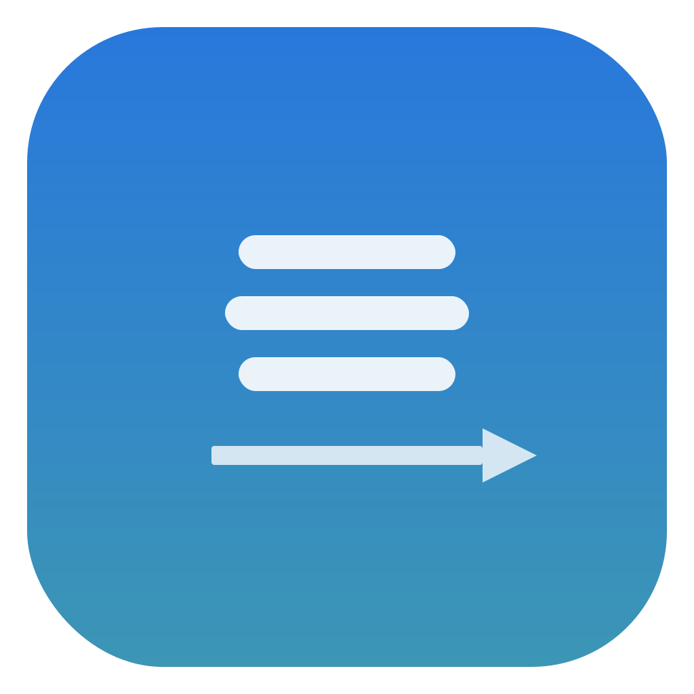

<p align="center">
  
</p>

# Swyper

A lightweight macOS menu bar app that maps three-finger trackpad swipe gestures to keyboard shortcuts, configurable per-application.

## Features

- **Global three-finger swipe detection** — works in any app, regardless of system trackpad settings
- **Per-app keyboard shortcut mappings** — configure different shortcuts for different apps, with a global default fallback
- **Menu bar app** — runs quietly in the background with no dock icon
- **Simple GUI** — settings window with shortcut recorder and per-app rule management
- **Launch at login** — optional auto-start support

## Requirements

- macOS 14 (Sonoma) or later
- Accessibility permission (for simulating keyboard shortcuts)
- Input Monitoring permission (for reading trackpad gestures)
- App Management permission (for auto-updates — see [Setup](#setup))

## Install

### From source

```bash
git clone <repo-url>
cd swyper
make bundle       # Builds build/Swyper.app
make install      # Copies to /Applications
```

### Setup

1. Launch Swyper — a hand icon appears in the menu bar
2. Grant **Accessibility** and **Input Monitoring** permissions when prompted (System Settings > Privacy & Security)
3. Grant **App Management** permission (System Settings > Privacy & Security > App Management) — this allows Swyper to update itself via the built-in auto-updater. macOS may require this permission before Sparkle can replace the app bundle during updates.
4. Open **Settings** from the menu bar icon to configure swipe-to-shortcut mappings

> **Note:** You may need to disable conflicting system three-finger gestures in System Settings > Trackpad > More Gestures, or switch them to four-finger gestures.

## Usage

### Default mappings

Set global shortcuts for swipe up/down/left/right that apply to all apps.

### Per-app mappings

Add app-specific overrides — for example, map left/right swipes to browser back/forward in Safari, and to tab switching in your editor. Per-app mappings take priority; any direction without an app-specific shortcut falls back to the default.

### Menu bar

- **Enabled** — toggle gesture detection on/off
- **Settings** — open the configuration window
- **Launch at Login** — start Swyper automatically on login
- **Quit** — exit the app

## Build

```bash
make build        # Compile with Swift Package Manager
make bundle       # Build + create .app bundle
make run          # Build + launch
make lint         # Run SwiftLint
make clean        # Remove build artifacts
```

## Testing

```bash
swift test       # Run the test suite
```

Tests cover model logic, config serialization/backward-compatibility, and the swipe detection algorithm. Tests run automatically on CI via GitHub Actions on pushes and pull requests to `main`.

## How it works

Swyper uses the private `MultitouchSupport.framework` (loaded dynamically via `dlopen`) to receive raw multitouch data from the trackpad. It tracks active touch points and detects when three fingers move together past a displacement threshold, then simulates the configured keyboard shortcut via the `CGEvent` API.

## License

MIT
